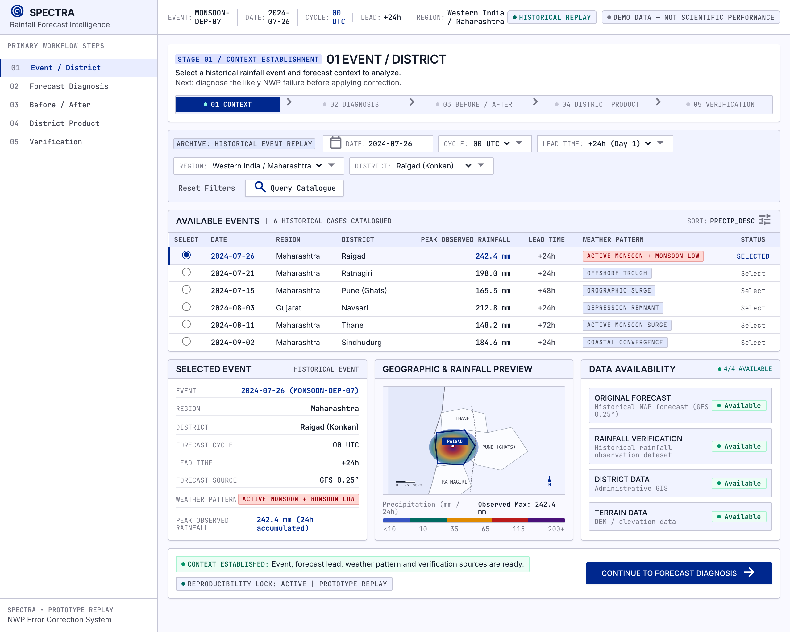
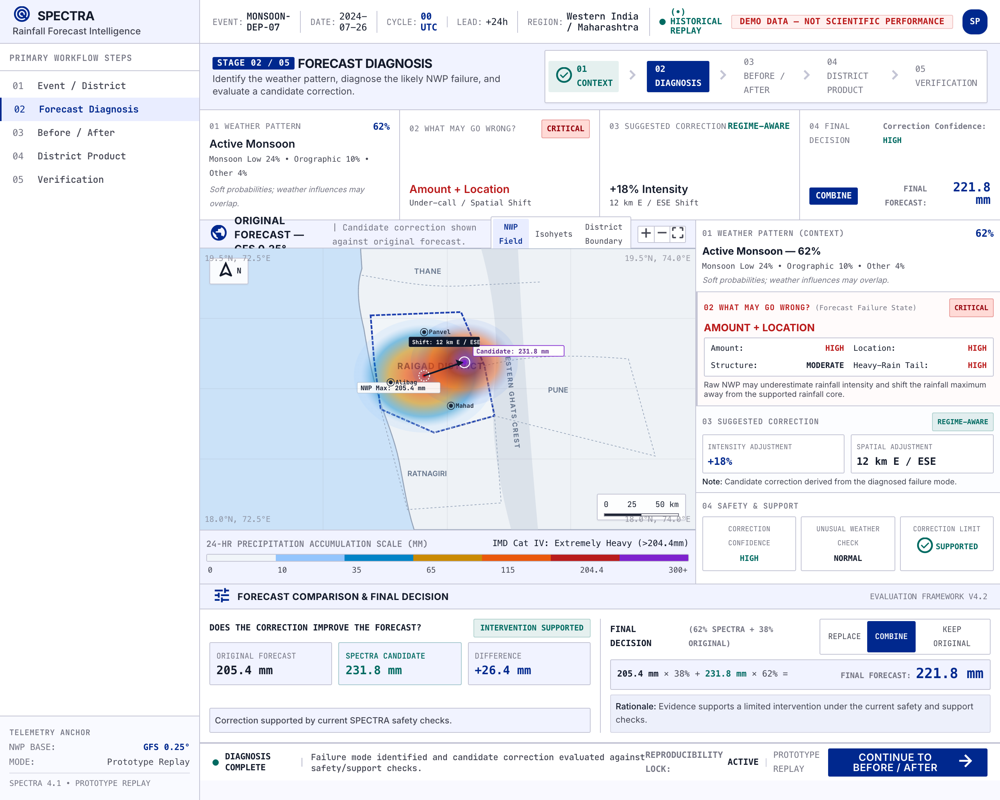
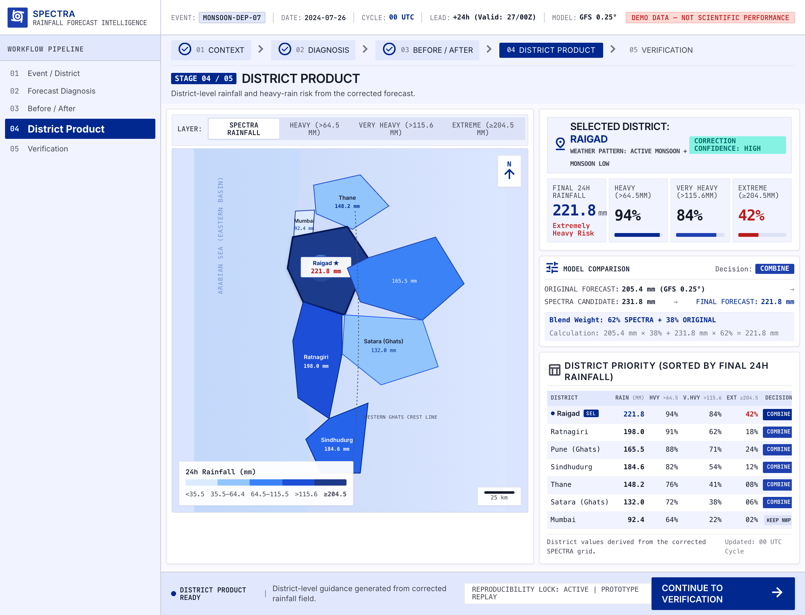

# SPECTRA

### Regime-aware rainfall forecast correction with failure diagnosis and selective intervention

**Diagnose. Repair. Verify. Decide.**

SPECTRA is a zero-cost, CPU-first system for post-processing rainfall forecasts. It predicts the weather regime and likely NWP failure mode, evaluates a constrained correction, estimates heavy-rain probabilities, and changes the baseline only when the intervention is supported.

[Core workflow](#core-workflow) · [Architecture](#architecture) · [Run locally](#run-locally)

> [!WARNING]
> **SPECTRA is under active development.** The current interface uses seeded demonstration values while the scientific data, training, and validation pipeline is being completed. Real scientifically validated values will be displayed here as the system matures.

## About SPECTRA

Numerical weather prediction can miss rainfall intensity, spatial placement, structure, timing, or the heavy-rain tail. SPECTRA makes those failure modes explicit and produces an explainable correction workflow.

Selective intervention is central to the system. REPLACE, COMBINE, and KEEP ORIGINAL are all valid outcomes. High uncertainty, unsupported corrections, or out-of-distribution conditions should reduce intervention rather than force a change.

## Core workflow

1. **Event / District** — select a historical event, district, forecast cycle, and lead time.
2. **Forecast Diagnosis** — identify the dominant weather regime and likely forecast failure.
3. **Before / After / Observation** — compare Raw NWP, candidate SPECTRA correction, observation, and difference.
4. **District Product** — translate the corrected field into district rainfall and heavy-rain risk.
5. **Verification** — compare models, thresholds, regimes, and intervention behavior.

## What SPECTRA produces

- Weather-regime probabilities.
- Forecast-failure probabilities for occurrence, amount, location, structure, heavy-rain tail, and conditional timing.
- Candidate corrected rainfall fields.
- Heavy-rain probability outputs.
- Correction confidence and support checks.
- REPLACE, COMBINE, or KEEP ORIGINAL decisions.
- Grid-level and district-level rainfall products.
- Verification metrics including RMSE, CSI, ETS, POD, FAR, FSS, calibration, and intervention behavior.

## Dashboard gallery

<table>
  <tr>
    <td align="center"><strong>Event / District</strong> </td>
    <td align="center"><strong>Forecast Diagnosis</strong> </td>
  </tr>
  <tr>
    <td align="center" colspan="2"><strong>District Product</strong> </td>
  </tr>
</table>

The repository currently contains three usable rendered dashboard images. Two additional screenshot paths are placeholder files and are intentionally not displayed here.

## Architecture

~~~mermaid
flowchart LR
    A[Raw GFS NWP] --> B[Forecast-time features]
    T[Terrain and season] --> B
    B --> C[Weather regime classifier]
    B --> D[Generic ML baseline]
    C --> E[Forecast failure model]
    D --> F[Regime-conditioned correction]
    E --> F
    F --> G[Leakage-safe challenger]
    G --> H[REPLACE / COMBINE / KEEP]
    H --> I[Rainfall and probability products]
    I --> J[Grid and district output]
    O[CHIRPS rainfall] --> K[Verification]
    J --> K
~~~

## Data and geographic scope

SPECTRA is focused on Maharashtra, with emphasis on Konkan and the Western Ghats.

- **Forecast:** NCEP GFS at 0.25° through public NOAA access.
- **Primary verification:** CHIRPS v3 daily rainfall, regridded to the verification grid.
- **Optional supplementary rainfall:** NASA GPM IMERG.
- **Terrain:** elevation, slope, aspect, relief, coastline distance, and land/sea features from an openly accessible DEM.
- **Boundaries:** openly licensed administrative district boundaries.

CHIRPS is used as a zero-cost verification reference. It is not the same as an official IMD or NCMRWF operational analysis.

## Run locally

### Requirements

- Node.js 20+
- Python 3.10+
- npm

### Frontend

~~~bash
cd App
npm install
npm run dev
~~~

Open http://localhost:5173.

### Backend

In a second terminal:

~~~bash
cd Backend
python -m venv .venv
source .venv/bin/activate       # Windows: .venv\Scripts\activate
pip install -r requirements.txt
python -m uvicorn main:app --reload --port 8000
~~~

Interactive API documentation: http://localhost:8000/api/docs

### Frontend verification

~~~bash
cd App
npm run lint
npm run build
~~~

## Scientific design

SPECTRA uses forecast-time information to predict likely failure and correction. Future observations are used to create historical labels and verify outputs, not as inference-time inputs.

The training path is event-first:

- freeze event splits before inspecting final results;
- fit transformations and models only on training events;
- generate out-of-fold predictions for challenger training;
- keep final test events untouched until the final scorecard.

The initial model family is CPU-first, using tabular ML, scikit-learn preprocessing and metrics, and scientific-data tooling such as xarray, netCDF4, cfgrib, and eccodes.

## Project structure

~~~text
spectra/
├── App/                 React + Vite interface
│   ├── src/screens/     Event, diagnosis, correction, district, verification
│   ├── src/components/  Shared layout and interface primitives
│   └── src/services/    Frontend API service layer
├── Backend/             FastAPI service
│   ├── routers/         Events, forecast, correction, district, verification
│   └── db/              Database integration path
├── configs/             Experiment, threshold, feature, and split settings
├── src/                 Scientific pipeline package
├── Frontend/            Workflow reference screens
├── data/                Local data, ignored by Git
├── models/              Local model artifacts, ignored by Git
└── outputs/             Generated products, ignored by Git
~~~

## Current status

SPECTRA is under active development. The repository contains a working interface and API prototype with seeded demonstration data. Real scientific values will be added after the data, training, and event-held-out validation pipeline is complete. Current demonstration values are not scientific results and must not be interpreted as operational forecasts.

## License

This project is provided under the [SPECTRA Showcase-Only License](LICENSE). It is not licensed for copying, modification, distribution, production use, or commercial use without written permission.
